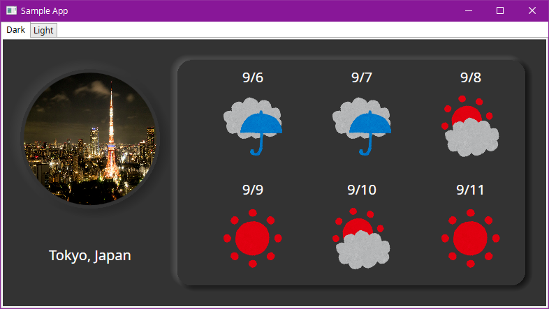
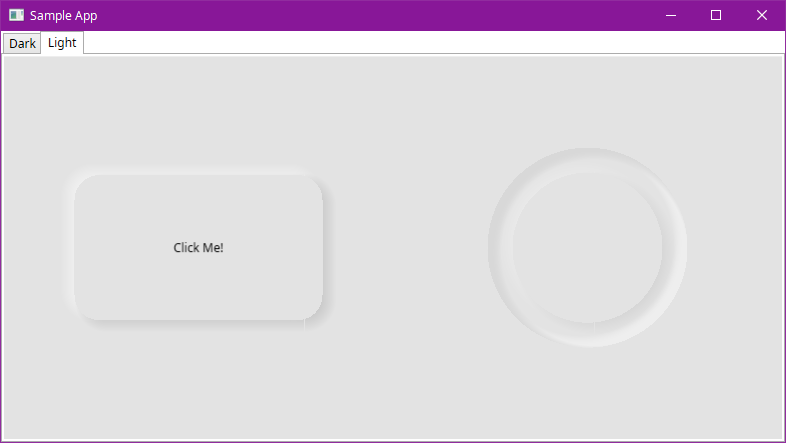
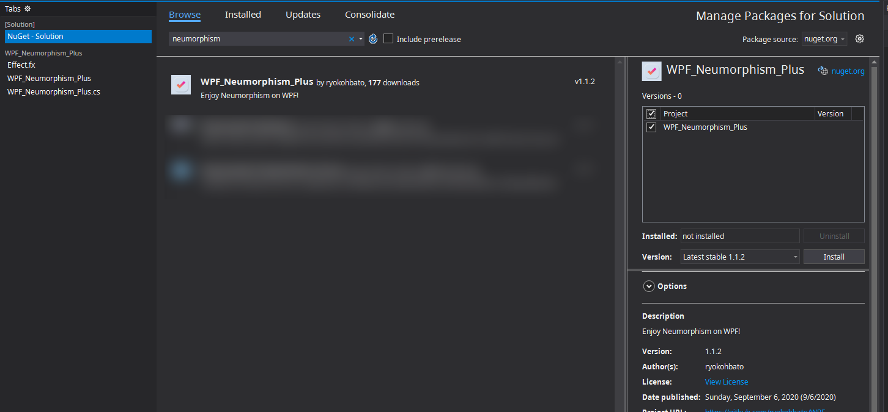
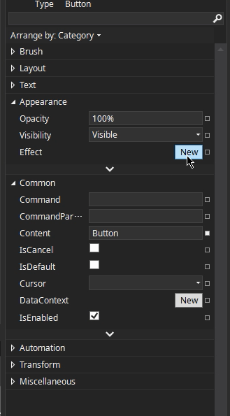
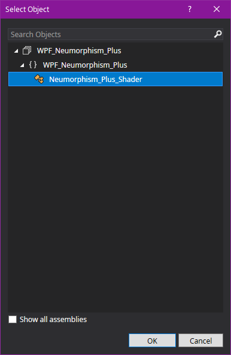
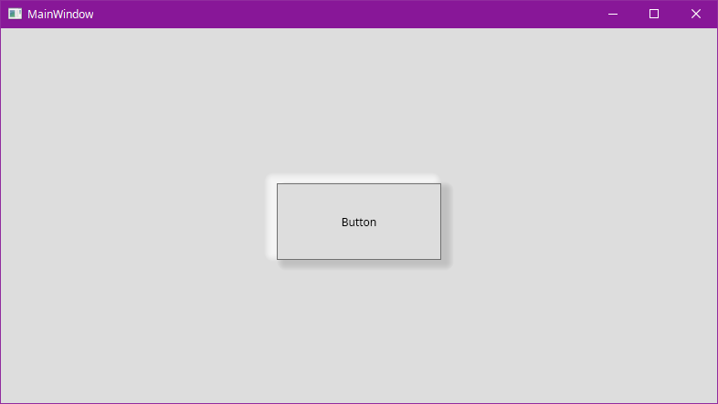

# WPF-Neumorphism-Plus

[](https://www.nuget.org/packages/WPF_Neumorphism_Plus/)

**WPF-Neumorphism-Plus** is a library for Neumorphism UI in WPF.

## DEMO




Sample code for this app can be found [here](https://github.com/ryokohbato/WPF-Neumorphism-Plus/tree/master/SampleApp).

## Features

This library allows you to implement a Neumorphism UI as an effect on any element of your WPF application.

## Requirement

- .NET Core 3.1  
- Windows

## Installation

### Visual Studio

``Tools > NuGet Package Manager > Manage NuGet Packages for Solution...``



### Package Manager
  
```bash
PM> Install-Package WPF_Neumorphism_Plus -Version [version]
```

### .NET CLI

```bash
$ dotnet add package WPF_Neumorphism_Plus --version [version]
```

## Usage

1. Install **WPF_Neumorphism_Plus**.

1. Add new effect from ``Appearance > Effect``  


1. Select **Neumorphism_Plus_Shader**  


The default style looks like this.



You can specify the direction, size and color of the shadow by specifying the options.

For more information on how to use it, please see here.

------------------------------

## Author

ryokohbato

## License

**WPF-Neumorphism-Plus** is under [MIT license](https://opensource.org/licenses/MIT).
