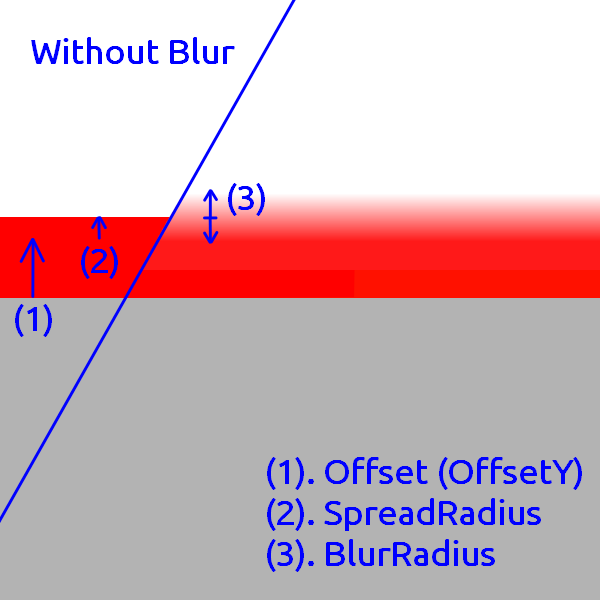
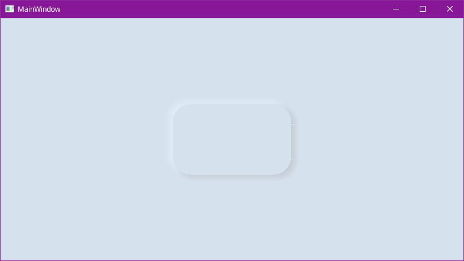
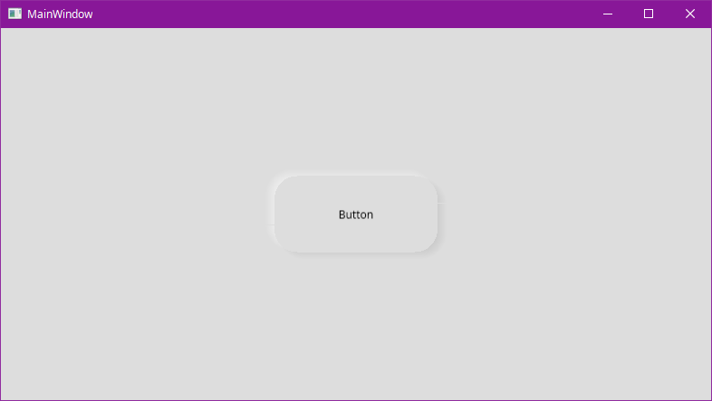

[](https://www.nuget.org/packages/WPF_Neumorphism_Plus/)

# WPF-Neumorphism-Plus

In this page, I will explain how to use WPF-Neumorphism-Plus in detail and what to expect when using it.

In WPF-Neumorphism-Plus, you can change the direction, size and color of the shadow by setting options.

Each option has a default value. If you don't explicitly specify a value for each option, the default value is used implicitly. In addition, the range of values that can be set may be pre-specified. If you specify a value out of the range, an unexpected failure may occur.

## Specifiable Options

### ``(double)`` OffsetX

``default value: 7.0``  

Specify the horizontal offset of the shadow.


### ``(double)`` OffsetY

``default value: 5.0``  

Specify the vertical offset of the shadow.


### ``(double)`` BlurRadius

``default value: 5.0``  

Specify the blur radius of the shadow.

> How to calculate the blur is explained in detail in the **RenderingMode section**.


### ``(double)`` SpreadRadius

``default value: 2.0``  

Specify the width to extend the shadow.


### ``(double)`` BorderRadius

``default value: 0.0``  

Specifies the border radius of the element to be shadowed. When used on rounded rectangles and circles, you must specify the same value as the border radius.
If you want to give a rounded corner shadow to a transparent element, however, you don't need to round the corners of the element, you just need to set the BorderRadius value. (See **How to create a standard Neumorphism UI with WPF-Neumorphism-Plus** section.)


### ``(System.Windows.Media.Colors)`` PrimaryColor

``default value: Colors.Silver``  

Specify the first color of the shadow.


### ``(System.Windows.Media.Colors)`` SecondaryColor

``default value: Colors.WhiteSmoke``  

Specify the second color of the shadow.


> Since the PrimaryColor is drawn after the SecondaryColor, the PrimaryColor will takes precedence over the SecondaryColor in the area where the PrimaryColor and the SecondaryColor overlap in color. However, this will not be a problem in most cases.


### ``(double)`` Inset

``default value: 0.0``  
``Available values: 0, 1``

Specifies whether the shadow is drawn inside the element. If this value is 0, the shadow will be drawn outside the element and the element will appear to be raised. If this value is 1, the shadow will be drawn inside the element and the element will appear to be sunken.


### ``(double)`` RenderingMode

``default value: 0.0``  
``Available values: 0, 1, 2 (As of v1.1.2)``

Specify the calculation method to draw the shadow. The formulas are assigned in order from 1 to 2. 1 and 2 are defined at v1.1.2. The number may be increased in future versions. If 0 is specified, the default value assigned by this library is used, and at the time of v1.1.2, it is the formula assigned to 2, but this may be changed in future versions.


#### Assigned formulas

1: y = x  
2: y = sin(x * 3.1415926 / 2)  


## How to draw shadows

- When Inset is 0
The element is expanded by the SpreadRadius width. Then it is blurred inside and outside by the width of the BlurRadius, respectively. This means that the length affected by the blur is twice as long as the BlurRadius. The shadow radius is the greater of (twice the length of the BlurRadius) or (BlurRadius + SpreadRadius + BorderRadius).

- When Inset is 1
The element is reduced by the width of the SpreadRadius. Then it is blurred inside and outside by the width of the BlurRadius, respectively. This means that the length affected by the blur is twice as long as the BlurRadius. The shadow radius is the larger of (BorderRadius) or (BlurRadius + SpreadRadius).



## How to create a standard Neumorphism UI with WPF-Neumorphism-Plus

You can use various expressions other than the methods introduced here. (e.g. dark theme) See also [Sample App](https://github.com/ryokohbato/WPF-Neumorphism-Plus/tree/master/SampleApp).

- Label  
1. Specify a light gray or light blue background color instead of white.
2. Add WPF-Neumorphism-Plus.

```xml

<Window
        xmlns="http://schemas.microsoft.com/winfx/2006/xaml/presentation"
        xmlns:x="http://schemas.microsoft.com/winfx/2006/xaml"
        xmlns:d="http://schemas.microsoft.com/expression/blend/2008"
        xmlns:mc="http://schemas.openxmlformats.org/markup-compatibility/2006"
        xmlns:local="clr-namespace:test"
        xmlns:WPF_Neumorphism_Plus="clr-namespace:WPF_Neumorphism_Plus;assembly=WPF_Neumorphism_Plus" x:Class="test.MainWindow"
        mc:Ignorable="d"
        Title="MainWindow" Height="450" Width="800" Background="#FFD5E1EC">
    <Grid>
        <Label Width="200" Height="120">
            <Label.Effect>
                <WPF_Neumorphism_Plus:Neumorphism_Plus_Shader/>
            </Label.Effect>
        </Label>
    </Grid>
</Window>

```

3. Specify a BorderRadius. (Since the Label is a transparent element, there is no need to round the corners of the Label element, just set the BorderRadius value.)
4. Adjust the color and size of the shadow.

```xml

<Window
        xmlns="http://schemas.microsoft.com/winfx/2006/xaml/presentation"
        xmlns:x="http://schemas.microsoft.com/winfx/2006/xaml"
        xmlns:d="http://schemas.microsoft.com/expression/blend/2008"
        xmlns:mc="http://schemas.openxmlformats.org/markup-compatibility/2006"
        xmlns:local="clr-namespace:test"
        xmlns:WPF_Neumorphism_Plus="clr-namespace:WPF_Neumorphism_Plus;assembly=WPF_Neumorphism_Plus" x:Class="test.MainWindow"
        mc:Ignorable="d"
        Title="MainWindow" Height="450" Width="800" Background="#FFD5E1EC">
    <Grid>
        <Label Width="200" Height="120">
            <Label.Effect>
                <WPF_Neumorphism_Plus:Neumorphism_Plus_Shader BorderRadius="30" PrimaryColor="#FFB9BDC5" SecondaryColor="#FFEAF6FB"/>
            </Label.Effect>
        </Label>
    </Grid>
</Window>

```



- Button  
1. Specify a light gray or light blue background color.

```xml

<Window
        xmlns="http://schemas.microsoft.com/winfx/2006/xaml/presentation"
        xmlns:x="http://schemas.microsoft.com/winfx/2006/xaml"
        xmlns:d="http://schemas.microsoft.com/expression/blend/2008"
        xmlns:mc="http://schemas.openxmlformats.org/markup-compatibility/2006"
        xmlns:local="clr-namespace:test"
        xmlns:WPF_Neumorphism_Plus="clr-namespace:WPF_Neumorphism_Plus;assembly=WPF_Neumorphism_Plus" x:Class="test.MainWindow"
        mc:Ignorable="d"
        Title="MainWindow" Height="450" Width="800" Background="#FFDDDDDD">
    <Grid>
        <Button Content="Button" HorizontalAlignment="Center" VerticalAlignment="Center" Height="84" Width="180"/>
    </Grid>
</Window>

```

2. Creating a Style for a button and add WPF-Neumorphism-Plus. In this case it is rounded rectangle shape.

```xml

<Window
        xmlns="http://schemas.microsoft.com/winfx/2006/xaml/presentation"
        xmlns:x="http://schemas.microsoft.com/winfx/2006/xaml"
        xmlns:d="http://schemas.microsoft.com/expression/blend/2008"
        xmlns:mc="http://schemas.openxmlformats.org/markup-compatibility/2006"
        xmlns:local="clr-namespace:test"
        xmlns:WPF_Neumorphism_Plus="clr-namespace:WPF_Neumorphism_Plus;assembly=WPF_Neumorphism_Plus" x:Class="test.MainWindow"
        mc:Ignorable="d"
        Title="MainWindow" Height="450" Width="800" Background="#FFDDDDDD">
    <Grid>
        <Grid.Resources>
            <Style x:Key="NeumorphismStyle_test" TargetType="Button">
                <Setter Property="Template">
                    <Setter.Value>
                        <ControlTemplate TargetType="Button">
                            <Grid>
                                <Grid.Effect>
                                    <WPF_Neumorphism_Plus:Neumorphism_Plus_Shader/>
                                </Grid.Effect>
                                <Rectangle Fill="{TemplateBinding Background}" RadiusX="25" RadiusY="25"/>
                                <ContentPresenter HorizontalAlignment="Center" VerticalAlignment="Center"/>
                            </Grid>
                        </ControlTemplate>
                    </Setter.Value>
                </Setter>
            </Style>
        </Grid.Resources>

        <Button Content="Button" Style="{StaticResource NeumorphismStyle_test}" HorizontalAlignment="Center" VerticalAlignment="Center" Height="84" Width="180"/>
    </Grid>
</Window>

```

3. Specify a BorderRadius. (Set up a border radius which is the same value as that of "Style".)
4. Adjust the color and size of the shadow.

```xml

<Window
        xmlns="http://schemas.microsoft.com/winfx/2006/xaml/presentation"
        xmlns:x="http://schemas.microsoft.com/winfx/2006/xaml"
        xmlns:d="http://schemas.microsoft.com/expression/blend/2008"
        xmlns:mc="http://schemas.openxmlformats.org/markup-compatibility/2006"
        xmlns:local="clr-namespace:test"
        xmlns:WPF_Neumorphism_Plus="clr-namespace:WPF_Neumorphism_Plus;assembly=WPF_Neumorphism_Plus" x:Class="test.MainWindow"
        mc:Ignorable="d"
        Title="MainWindow" Height="450" Width="800" Background="#FFDDDDDD">
    <Grid>
        <Grid.Resources>
            <Style x:Key="NeumorphismStyle_test" TargetType="Button">
                <Setter Property="Template">
                    <Setter.Value>
                        <ControlTemplate TargetType="Button">
                            <Grid>
                                <Grid.Effect>
                                    <WPF_Neumorphism_Plus:Neumorphism_Plus_Shader BorderRadius="25" BlurRadius="3" SpreadRadius="0"/>
                                </Grid.Effect>
                                <Rectangle Fill="{TemplateBinding Background}" RadiusX="25" RadiusY="25"/>
                                <ContentPresenter HorizontalAlignment="Center" VerticalAlignment="Center"/>
                            </Grid>
                        </ControlTemplate>
                    </Setter.Value>
                </Setter>
            </Style>
        </Grid.Resources>
        <Button Content="Button" Style="{StaticResource NeumorphismStyle_test}" HorizontalAlignment="Center" VerticalAlignment="Center" Height="84" Width="180"/>
    </Grid>
</Window>

```


